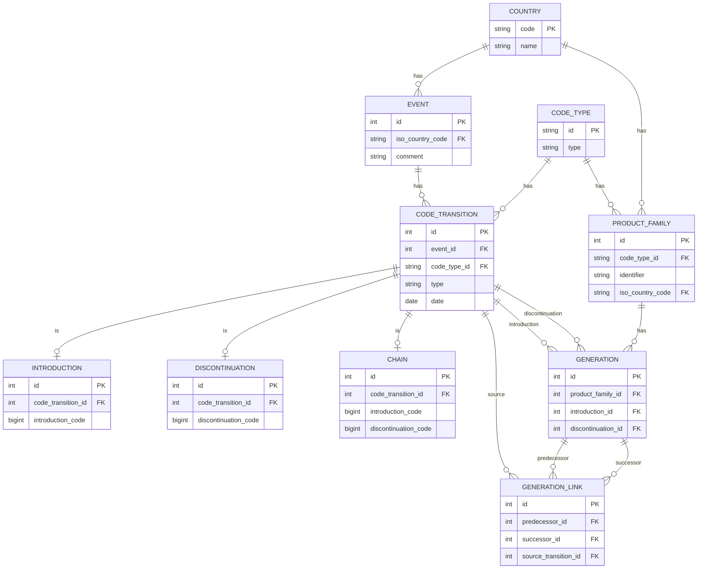

# Chains

A Django application for tracking product code lifecycles. Events record when codes are introduced, discontinued, or chained (one code replaces another). A graph engine groups related codes into **product families** and **generations**.

## Data Model

