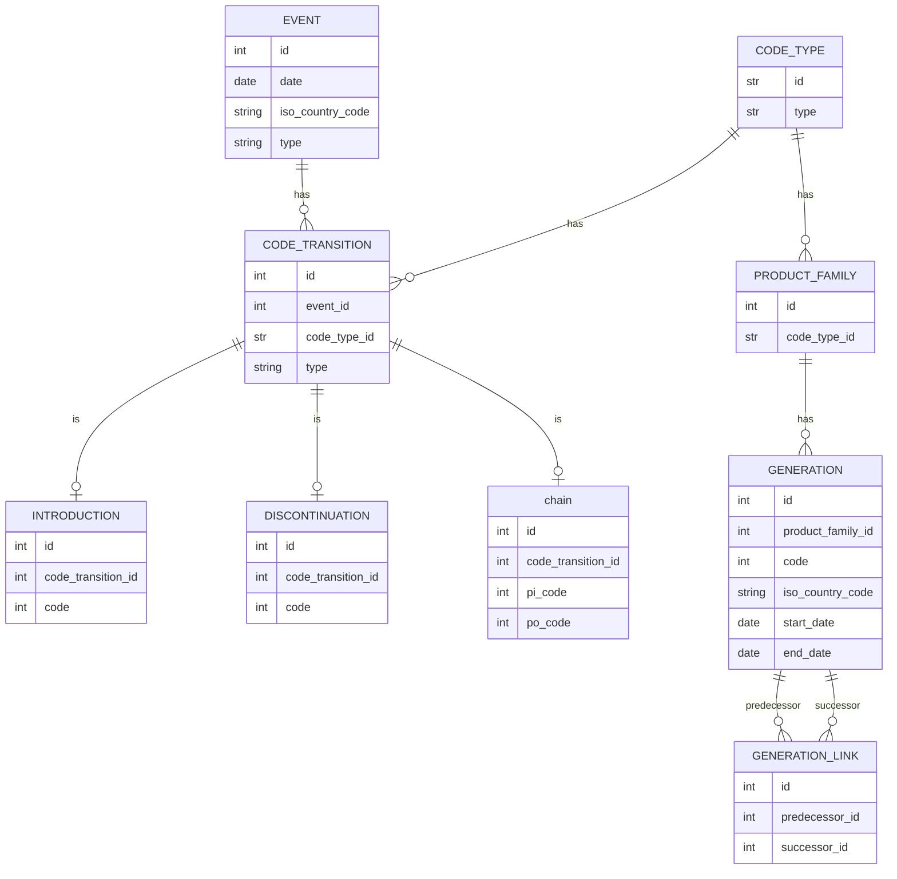

```mermaid
erDiagram
    EVENT {
        int id
        date date
        string iso_country_code
        string type
    }

    CODE_TRANSITION {
        int id
        int event_id
        str code_type_id
        string type
    }

    INTRODUCTION {
        int id
        int code_transition_id
        int code
    }
    DISCONTINUATION {
        int id
        int code_transition_id
        int code
    }
    chain {
        int id
        int code_transition_id
        int pi_code
        int po_code
    }

    PRODUCT_FAMILY {
        int id
        str code_type_id
    }

    GENERATION {
        int id
        int product_family_id
        int code
        string iso_country_code
        date start_date
        date end_date
    }

    GENERATION_LINK {
        int id
        int predecessor_id
        int successor_id
    }

    CODE_TYPE {
        str id
        str type
    }

    EVENT ||--o{ CODE_TRANSITION : "has"
    CODE_TYPE ||--o{ CODE_TRANSITION : "has"
    CODE_TRANSITION ||--o| INTRODUCTION : "is"
    CODE_TRANSITION ||--o| DISCONTINUATION : "is"
    CODE_TRANSITION ||--o| chain : "is"
    CODE_TYPE ||--o{ PRODUCT_FAMILY : "has"
    PRODUCT_FAMILY ||--o{ GENERATION : "has"
    GENERATION ||--o{ GENERATION_LINK : "predecessor"
    GENERATION ||--o{ GENERATION_LINK : "successor"

```

